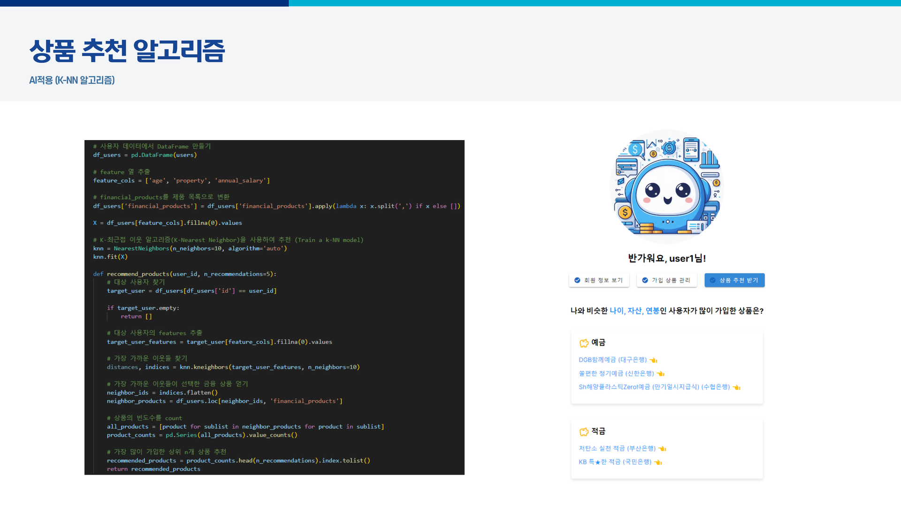

# UMMM

## ✔프로젝트 개요

- 목표 : 금융 상품 조회 및 추천 서비스

- 기간 : 2024.05.16(목) ~ 2024.05.24(금)

 

## ✔서비스 소개

- **UMMM**은 "Your money, my money"의 약자로, 당신의 돈을 제 돈처럼 관리해 드린다는 의미를 담고 있습니다.

- **UMMM**은 금융 상품 조회 및 추천 서비스로, 사용자의 나이, 자산, 연봉 등 개인 정보를 바탕으로 비슷한 다른 사용자들이 많이 가입한 금융 상품을 추천해 드립니다. 또한, 다양한 금융 상품을 손쉽게 조회할 수 있어, 당신에게 가장 적합한 금융 상품을 찾는 데 도움을 드립니다.

- **UMMM**와 함께라면, 복잡한 금융 상품 선택이 더 이상 어렵지 않습니다. 신뢰할 수 있는 맞춤형 금융 상품 추천과 쉬운 조회 서비스로, 당신의 금융 생활을 더욱 편리하게 만들어드립니다.
  
   

## ✔ERD

 

## ✔서비스 화면 및 기능

**UMMM**의 페이지에서는 다음과 같은 기능을 제공합니다.

##### 🔹 메인 페이지

- 다양한 은행의 상품 중에서 금리가 높은 인기 상품을 소개합니다. 또한 UMMM의 추천 알고리즘을 통한 금융 상품도 소개합니다. 또한 ChatGPT API를 이용하여 챗봇을 구현했습니다. 이는 사용자의 금융 생활을 더욱 효율적으로 관리할 수 있도록 도와줍니다.

##### 🔹 예적금 상품 조회

- 여러 은행의 예적금 상품을 한눈에 비교하여 조회할 수 있습니다. 테이블의 header를 클릭하여 각 콜롬을 정렬할 수 있고, 원하는 은행을 선택하여 필터링을 할 수 있습니다. 이곳에서 각 상품의 금리, 기간 등을 확인하고, 예적금 상품에 가입할 수 있습니다.

##### 🔹 환율 계산기

- 실시간으로 업데이트되는 환율 정보를 바탕으로 다양한 통화 간 환율을 계산할 수 있는 간편한 환율 계산기를 제공합니다. 해외 거래나 여행 시 편리하게 환율을 확인할 수 있습니다.

##### 🔹 은행 검색 지도

- 사용자가 요구하는 위치를 기반으로 원하는 은행을 지도에서 쉽게 찾을 수 있는 기능을 제공합니다. 은행의 위치를 확인하여 편리하게 은행을 찾을 수 있습니다.

##### 🔹 커뮤니티

- 금융 상품에 대한 정보 공유 및 소통을 위한 커뮤니티 기능을 제공합니다. 다른 사용자들과의 의견 교환, 질문 및 답변 등을 통해 유용한 정보를 공유하고 소통할 수 있습니다.

##### 🔹 회원 페이지

- 사용자의 개인 정보와 현재 가입한 금융 상품을 편리하게 관리할 수 있습니다. 또한 사용자의 나이, 자산, 연봉 등의 정보를 분석하여 비슷한 다른 사용자들이 많이 가입한 상품을 추천해 줍니다. 이를 통해 사용자는 효율적으로 금융 상품을 가입할 수 있습니다.

##### 🔹 상품 추천 알고리즘

- 사용자의 나이, 자산, 연봉을 분석하여 맞춤형 상품을 추천해 주는 알고리즘을 활용합니다. K-NN 알고리즘을 사용하여 사용자와 유사한 사람들의 가입 상품을 분석하여 맞춤형 금융 상품을 추천합니다. 이로 인해 더 나은 금융 생활을 지원할 수 있습니다.
  
   

## ✔일정

##### ◻ 5월 16일(목)

- API 분석 및 설계, 데이터 모델링

- 목업 작성

###### 문제점 개선 및 논의 사항

- 향후 기능에 따라 데이터 추가 또는 삭제가 필요할 수 있으므로, API에서 제공하는 필드를 모두 가져와서 저장함. 삭제 또는 추가를 원하는 경우 유연하게 수정할 예정.

##### ◻ 5월 17일(금)

- ERD 작성
- 회원가입, 로그인, 로그아웃 구현
- 게시글 작성, 수정, 삭제 설계

###### 문제점 개선 및 논의 사항

- Token 발급 및 사용 시 401 Unauthorized과 403 Forbidden 에러가 반복해서 뜸. axios에서 header를 추가하지 않아서 발생한 문제여서 쉽게 해결할 수 있었음.

##### ◻ 5월 20일(월)

- 프로필, 게시판 구현
- 환율, 지도 검색 구현
- 디자인 및 CSS

###### 문제점 개선 및 논의 사항

- 지도에서 한 번 검색 후 다시 검색하면 이전에 띄운 마커가 그대로 남아 있음. 응답하는 데이터를 수정하고 다시 저장함.
- 프론트엔드에서 환율 API를 이용해 데이터를 받게끔 구현을 하니 CORS 에러가 뜸. 백엔드에서 API에 요청을 보내 데이터를 받고, 이를 가져오는 방법으로 해결함.

##### ◻ 5월 21일(화)

- 챗봇 디자인 및 구현
- 금융상품 조회 및 정렬, 상품 가입 및 관리 구현
- 디자인 및 CSS

###### 문제점 개선 및 논의 사항

- 상품 가입하기 버튼을 클릭하면 사용자 데이터에 저장되지 않음. User 모델의 financial_products 필드가 TextField 임을 고려하여 split과 join을 이용하여 해결함.
- 금융상품 정렬을 콜롬 별로 하기 위해 어떤 방법이 가장 적합할지 논의함.

##### ◻ 5월 22일(수)

- 맞춤형 상품 추천 알고리즘 구현

- 챗봇 프롬포트 작성

- 디자인 및 CSS

###### 문제점 개선 및 논의 사항

- 더미 데이터를 랜덤으로 생성하기 때문에 적절한 알고리즘을 찾기 위해 노력함.

##### ◻ 5월 23일(목)

- 기능 테스트 및 버그 수정

- 중복 코드 제거 및 리팩토링

- 디자인 및 CSS

- README 정리 및 PPT 제작

###### 문제점 개선 및 논의 사항

- 코드의 복잡도를 줄이고 유지 보수성을 향상시킴.

- 사용자 편의성을 고려하여 UI를 개선함.
  
   

## ✔팀원 소개

- 강미연(팀장)
  
  - API 분석 및 설계, 데이터 모델링
  
  - 금융상품 조회 및 금리 비교, 게시판 로직 구현
  
  - 프로필, 금융상품 조회, 게시판, 환율, 지도 검색 로직 구현
  
  - 상품 가입 및 관리, 맞춤형 추천 알고리즘, 챗봇 구현
  
  - 디자인 및 CSS
  
  - README 작성

- 강현정(팀원)
  
  - 회원가입, 로그인, 로그아웃, 프로필 로직 구현
  
  - 환율, 지도 검색 로직 구현
  
  - 디자인 및 CSS
  
  - ERD & README 작성, PPT 제작

 

## ✔회고

- 강미연(팀장)
  
  - 학습한 내용들을 토대로 만드는 최종 결과물이기에 기능들과 디자인까지 생각하며 최선을 다해서 작업을 했습니다. 일주일동안 프로젝트 하나에만 매진해본 값진 경험이었습니다.

- 강현정(팀원)
  
  - 배운 내용을 내 것으로 만들지 못한 상태여서 프로젝트 동안 팀장님께 많이 의지했고 부족한 부분 때문에 힘들었지만, 코드를 짜서 무에서 유를 창조하는 과정이 우리 손에서 나오는 게 신기하고 뿌듯했습니다. 거인의 어깨에서 배우는 소중한 경험이었습니다.
